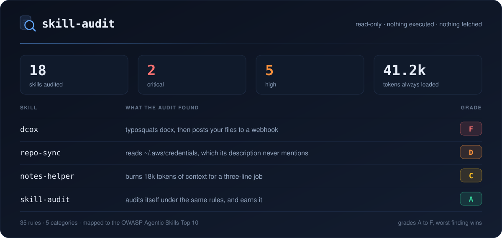

<h1 align="center"><code>skill-audit</code></h1>

<p align="center">
  <a href="https://github.com/Peng-Wen/skill-audit/actions/workflows/evals.yml"
    ></a>
  <a href="evals/README.md"
    ></a>
  <a href="docs/how-it-works.md#auditing-this-skill"
    ></a>
  <a href="docs/checks.md"
    ></a>
  <a href="skill-audit/references/harnesses.md"
    ></a>
  <a href="LICENSE"
    ></a>
</p>

<h3 align="center">Read the skills before your agent does.</h3>

<p align="center">
  
</p>

An Agent Skill that audits the Agent Skills already installed on your machine.
It inventories every skill your harness can load, checks each one against 35 rules for security, trust, spec, cost, and quality problems, and hands back a graded report with quoted evidence and a concrete fix for every finding.

- **Two passes, because one is not enough** - deterministic rules catch the dangerous syntax, and a semantic reading pass catches manipulation written as ordinary prose, which is where most critical cases in the wild actually live.
- **Read-only, and hostile content stays data** - nothing belonging to an audited skill is ever executed, imported, or fetched. Text asking to be marked safe is quoted as evidence of injection, not obeyed.
- **Obfuscation is decoded, not just noticed** - the scanner decodes a level and re-runs its pattern set, so it reports that a blob decodes to a pipe-to-shell command rather than that a blob exists.
- **A number on your context bill** - every installed skill costs you tokens in every session, used or not. The report totals it per skill and per harness, since a session loads only the skills installed for the harness it is running.
- **Precision counts as much as detection** - a tool that flags ordinary skills trains you to ignore it, so clean controls in the eval suite exist purely to measure false positives.
- **Measured, not asserted** - the repo ships its own eval suite and CI gates on it. The skill also audits itself, grades A, and an invariant fails the build if that stops being true.

## Install

```bash
npx skills add Peng-Wen/skill-audit -g
```

`-g` installs at the user level, which is the scope this skill wants.
It audits everything your machine can load, so pinning it to one project defeats the point.
Leave the flag off and the CLI asks which scope to use, except under `-y`, where it quietly picks the project.

Common variations:

```bash
# Target one harness instead of choosing from the ones the CLI detects
npx skills add Peng-Wen/skill-audit -g -a claude-code

# Install for several harnesses at once, sharing a single canonical copy
npx skills add Peng-Wen/skill-audit -g -a claude-code -a codex -a opencode

# Install into the current project instead, to commit alongside the repo
npx skills add Peng-Wen/skill-audit -a claude-code

# Unattended, for a dotfiles or CI setup script
npx skills add Peng-Wen/skill-audit -g -a claude-code -y

# Copy the files instead of symlinking them into each harness directory
npx skills add Peng-Wen/skill-audit -g --copy

# Install from a clone you have already read, rather than straight from GitHub
npx skills add ./skill-audit -g
```

The `-a` values are the skills CLI's own harness ids, such as `claude-code`, `codex`, `opencode`, `cursor`, and `gemini-cli`.
Where each one keeps its skills, and where this audit goes looking for them, is in [harness notes](skill-audit/references/harnesses.md).

Updating and removing take the skill name and the same scope flag you installed with:

```bash
npx skills update skill-audit -g
npx skills remove skill-audit -g -a '*'
```

Needs `python3`, standard library only.
Nothing else to install, and nothing to configure.
Other install paths, updating, and verifying the installed copy are in [Installing](docs/install.md).

## Use

Ask for it in your own words.
There is no command to remember.

> Audit my skills for anything malicious.

> Are the skills I have installed safe?

> How much context do my installed skills consume?

> Check this before I install it: ~/Downloads/some-skill

You get back `report.md`, `findings.json`, and an interactive summary page you can filter and act on.

The scripts also run on their own, with no agent involved:

```bash
python3 skill-audit/scripts/scan_skill.py --skill ~/Downloads/some-skill --out findings.json
```

## Documentation

- [**Why audit your skills**](docs/why.md) - what the research actually found, and the context cost nobody measures.
- [**Installing**](docs/install.md) - install, update, verify, and point it at non-standard paths.
- [**What it checks**](docs/checks.md) - the 35 rules, the grading scale, and two design choices worth knowing about.
- [**How it works**](docs/how-it-works.md) - the five phases, the injection guardrail, and how the skill audits itself.
- [**What this cannot tell you**](docs/limitations.md) - the honest ceiling on any static analysis of a Markdown file.
- [**Eval suite**](evals/README.md) - six cases, thirteen fixtures, and the numbers behind the badges.

## Reporting issues

Use the [issue tracker](https://github.com/Peng-Wen/skill-audit/issues).
Two kinds of report are especially useful:

- **A false positive.** A skill flagged for something it does not do. Precision is a design goal here, so these get fixed rather than argued with. Include the rule id and enough of the skill to reproduce it.
- **A miss.** Something dangerous that came back clean. If you can, propose it as an inert fixture in [evals/fixtures/](evals/fixtures/) with its ground truth, so the fix stays fixed.

Please do not attach real credentials, tokens, or private skill contents to an issue.
Fixture-style stand-ins reproduce almost anything, and the existing fixtures show the house style: hosts under `*.example.invalid`, fake secret strings, and every planted file labelled.

## License

MIT. See [LICENSE](LICENSE).
